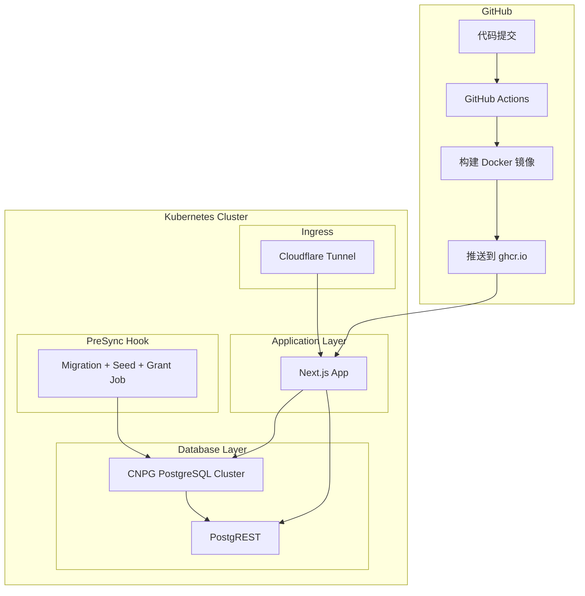

# CI/CD Pipeline 与 Kubernetes 部署方案

## 概述

本方案为 db-frontend-example 项目添加：
1. Docker 容器化支持（构建时注入环境变量，DATABASE_URL 运行时注入）
2. GitHub Actions CI Pipeline（自动构建并推送到 ghcr.io，仅 amd64）
3. Kustomize K8s 部署配置（仅 dev 环境，使用 Cloudflare Tunnel Ingress）
4. CloudNativePG (CNPG) PostgreSQL 数据库部署
5. PostgREST API 服务部署
6. 数据库初始化作为 ArgoCD PreSync Hook

## 架构设计



## 文件结构

```
db-frontend-example/
├── Dockerfile                          # Next.js 多阶段构建
├── Dockerfile.migrate                  # 数据库迁移镜像
├── .dockerignore                       # Docker 忽略文件
├── .github/
│   └── workflows/
│       └── docker-build.yml           # CI Pipeline
├── k8s/
│   ├── postgres-cluster/              # CNPG PostgreSQL 配置
│   │   └── dev/
│   │       ├── kustomization.yaml
│   │       └── cluster.yaml
│   ├── postgrest/                     # PostgREST 配置
│   │   └── dev/
│   │       ├── kustomization.yaml
│   │       ├── deployment.yaml
│   │       └── service.yaml
│   └── nextjs-app/                    # Next.js 应用配置（含 db-init PreSync）
│       └── dev/
│           ├── kustomization.yaml
│           ├── deployment.yaml
│           ├── service.yaml
│           ├── ingress.yaml
│           ├── configmap.yaml
│           └── db-init-job.yaml       # ArgoCD PreSync Hook
└── next.config.ts                      # 需修改：启用 standalone
```

---

## 关键设计决策

### 1. 环境变量处理

| 变量类型 | 处理方式 | 示例 |
|---------|---------|------|
| `NEXT_PUBLIC_*` | 构建时注入（写死在镜像中） | `NEXT_PUBLIC_POSTGREST_URL` |
| `DATABASE_URL` | 运行时通过 K8s Secret 注入 | CNPG 自动生成的 Secret |

**原因**：
- `NEXT_PUBLIC_*` 变量会被编译到客户端 JS 中，必须在构建时确定
- `DATABASE_URL` 是服务端变量，可以在运行时注入

### 2. 数据库初始化流程

**为什么需要 init.sql？**

Prisma 和 init.sql 各司其职：

| 工具 | 职责 |
|-----|------|
| Prisma migrate | 创建和管理表结构（users, posts, categories 等） |
| Prisma seed | 插入初始数据 |
| init.sql | 创建 PostgREST 所需的角色和权限（web_anon, authenticator） |

**执行顺序**：
1. `prisma migrate deploy` - 创建表结构
2. `prisma db seed` - 插入种子数据
3. `init.sql` - 创建角色并授予权限
4. `grant_web_anon_select()` - 授予现有表的 SELECT 权限

### 3. ArgoCD 部署策略

数据库初始化作为 nextjs-app 的 **PreSync Hook**：

```yaml
annotations:
  argocd.argoproj.io/hook: PreSync
  argocd.argoproj.io/hook-delete-policy: HookSucceeded
```

这样确保在 Next.js 应用启动前，数据库已经准备就绪。

---

## 详细实施计划

### 1. 修改 next.config.ts

启用 `standalone` 输出模式：

```typescript
// next.config.ts
import type { NextConfig } from 'next'

const nextConfig: NextConfig = {
  output: 'standalone',
  reactStrictMode: true,
}

export default nextConfig
```

---

### 2. 创建 Dockerfile（Next.js 应用）

```dockerfile
# Dockerfile

# ===========================================
# Stage 1: Dependencies
# ===========================================
FROM node:22-alpine AS deps
RUN apk add --no-cache libc6-compat
WORKDIR /app

# 安装 pnpm
RUN corepack enable && corepack prepare pnpm@9 --activate

# 复制依赖文件
COPY package.json pnpm-lock.yaml ./
COPY prisma ./prisma/

# 安装依赖
RUN pnpm install --frozen-lockfile

# ===========================================
# Stage 2: Builder
# ===========================================
FROM node:22-alpine AS builder
WORKDIR /app

RUN corepack enable && corepack prepare pnpm@9 --activate

COPY --from=deps /app/node_modules ./node_modules
COPY . .

# 构建时注入环境变量（dev 环境专用）
ARG NEXT_PUBLIC_POSTGREST_URL
ARG NEXT_PUBLIC_APP_URL
ENV NEXT_PUBLIC_POSTGREST_URL=${NEXT_PUBLIC_POSTGREST_URL}
ENV NEXT_PUBLIC_APP_URL=${NEXT_PUBLIC_APP_URL}

# 生成 Prisma Client
RUN pnpm db:generate

# 构建 Next.js
RUN pnpm build

# ===========================================
# Stage 3: Runner
# ===========================================
FROM node:22-alpine AS runner
WORKDIR /app

ENV NODE_ENV=production

# 创建非 root 用户
RUN addgroup --system --gid 1001 nodejs
RUN adduser --system --uid 1001 nextjs

# 复制必要文件
COPY --from=builder /app/public ./public
COPY --from=builder /app/.next/standalone ./
COPY --from=builder /app/.next/static ./.next/static

# 设置权限
RUN chown -R nextjs:nodejs /app

USER nextjs

EXPOSE 3000

ENV PORT=3000
ENV HOSTNAME="0.0.0.0"

CMD ["node", "server.js"]
```

---

### 3. 创建 Dockerfile.migrate（数据库迁移镜像）

```dockerfile
# Dockerfile.migrate
# 用于运行 Prisma 迁移、seed 和 PostgREST 权限配置

FROM node:22-alpine

RUN apk add --no-cache libc6-compat postgresql16-client
WORKDIR /app

# 安装 pnpm
RUN corepack enable && corepack prepare pnpm@9 --activate

# 复制依赖文件
COPY package.json pnpm-lock.yaml ./
COPY prisma ./prisma/
COPY prisma.config.ts ./

# 安装依赖（包括 devDependencies）
RUN pnpm install --frozen-lockfile

# 复制 init.sql
COPY docker/postgres/init.sql ./init.sql

# 创建初始化脚本
COPY <<'EOF' /app/init-db.sh
#!/bin/sh
set -e

echo "🚀 开始数据库初始化..."

echo "📦 运行 Prisma 迁移..."
pnpm prisma migrate deploy

echo "🌱 运行数据库 seed..."
pnpm db:seed

echo "🔐 配置 PostgREST 权限..."
psql "$DATABASE_URL" -f /app/init.sql

echo "✅ 授予表权限..."
psql "$DATABASE_URL" -c "SELECT grant_web_anon_select();"

echo "🎉 数据库初始化完成！"
EOF

RUN chmod +x /app/init-db.sh

CMD ["/app/init-db.sh"]
```

---

### 4. 创建 .dockerignore

```
# .dockerignore
node_modules
.pnpm-store
.next
out
build
dist
.env
.env.local
.env.*.local
.idea
.vscode
*.swp
*.swo
.DS_Store
Thumbs.db
.git
.gitignore
Dockerfile*
docker-compose*.yml
k8s/
*.md
docs/
coverage/
.nyc_output/
*.log
*.pem
.vercel
.direnv
result
result-*
plans/
```

---

### 5. 创建 GitHub Actions CI Pipeline

```yaml
# .github/workflows/docker-build.yml

name: Build and Push Docker Images

on:
  push:
    branches: [main, develop]
    tags: ['v*']
  pull_request:
    branches: [main]

env:
  REGISTRY: ghcr.io
  IMAGE_NAME: ${{ github.repository }}

jobs:
  build-nextjs:
    runs-on: ubuntu-latest
    permissions:
      contents: read
      packages: write

    steps:
      - name: Checkout repository
        uses: actions/checkout@v4

      - name: Set up Docker Buildx
        uses: docker/setup-buildx-action@v3

      - name: Log in to Container Registry
        if: github.event_name != 'pull_request'
        uses: docker/login-action@v3
        with:
          registry: ${{ env.REGISTRY }}
          username: ${{ github.actor }}
          password: ${{ secrets.GITHUB_TOKEN }}

      - name: Extract metadata for Docker
        id: meta
        uses: docker/metadata-action@v5
        with:
          images: ${{ env.REGISTRY }}/${{ env.IMAGE_NAME }}
          tags: |
            type=ref,event=branch
            type=ref,event=pr
            type=semver,pattern={{version}}
            type=semver,pattern={{major}}.{{minor}}
            type=sha,prefix=sha-

      - name: Build and push Next.js image
        uses: docker/build-push-action@v5
        with:
          context: .
          file: ./Dockerfile
          push: ${{ github.event_name != 'pull_request' }}
          tags: ${{ steps.meta.outputs.tags }}
          labels: ${{ steps.meta.outputs.labels }}
          cache-from: type=gha
          cache-to: type=gha,mode=max
          build-args: |
            NEXT_PUBLIC_POSTGREST_URL=http://postgrest:3000
            NEXT_PUBLIC_APP_URL=https://blog-dev.your-domain.com

  build-migrate:
    runs-on: ubuntu-latest
    permissions:
      contents: read
      packages: write

    steps:
      - name: Checkout repository
        uses: actions/checkout@v4

      - name: Set up Docker Buildx
        uses: docker/setup-buildx-action@v3

      - name: Log in to Container Registry
        if: github.event_name != 'pull_request'
        uses: docker/login-action@v3
        with:
          registry: ${{ env.REGISTRY }}
          username: ${{ github.actor }}
          password: ${{ secrets.GITHUB_TOKEN }}

      - name: Extract metadata for Docker
        id: meta
        uses: docker/metadata-action@v5
        with:
          images: ${{ env.REGISTRY }}/${{ env.IMAGE_NAME }}-migrate
          tags: |
            type=ref,event=branch
            type=ref,event=pr
            type=semver,pattern={{version}}
            type=sha,prefix=sha-

      - name: Build and push migrate image
        uses: docker/build-push-action@v5
        with:
          context: .
          file: ./Dockerfile.migrate
          push: ${{ github.event_name != 'pull_request' }}
          tags: ${{ steps.meta.outputs.tags }}
          labels: ${{ steps.meta.outputs.labels }}
          cache-from: type=gha
          cache-to: type=gha,mode=max
```

---

### 6. CNPG PostgreSQL 集群配置

**k8s/postgres-cluster/dev/cluster.yaml**
```yaml
apiVersion: postgresql.cnpg.io/v1
kind: Cluster
metadata:
  name: blog-postgres
  namespace: cmp-dev-1
spec:
  instances: 1
  
  postgresql:
    parameters:
      max_connections: "100"
      shared_buffers: "256MB"
  
  storage:
    size: 5Gi
    storageClass: local-path
  
  bootstrap:
    initdb:
      database: blog_db
      owner: blog_user
  
  resources:
    requests:
      memory: "256Mi"
      cpu: "100m"
    limits:
      memory: "512Mi"
      cpu: "500m"
```

**k8s/postgres-cluster/dev/kustomization.yaml**
```yaml
apiVersion: kustomize.config.k8s.io/v1beta1
kind: Kustomization

namespace: cmp-dev-1

resources:
  - cluster.yaml

commonLabels:
  app.kubernetes.io/component: database
  app.kubernetes.io/part-of: blog-app
```

---

### 7. PostgREST 配置

**k8s/postgrest/dev/deployment.yaml**
```yaml
apiVersion: apps/v1
kind: Deployment
metadata:
  name: postgrest
  namespace: cmp-dev-1
spec:
  replicas: 1
  selector:
    matchLabels:
      app: postgrest
  template:
    metadata:
      labels:
        app: postgrest
    spec:
      containers:
        - name: postgrest
          image: postgrest/postgrest:v12.2.3
          ports:
            - containerPort: 3000
          env:
            - name: PGRST_DB_URI
              valueFrom:
                secretKeyRef:
                  name: blog-postgres-app
                  key: uri
            - name: PGRST_DB_SCHEMAS
              value: "public"
            - name: PGRST_DB_ANON_ROLE
              value: "web_anon"
            - name: PGRST_SERVER_PORT
              value: "3000"
          resources:
            requests:
              memory: "64Mi"
              cpu: "50m"
            limits:
              memory: "128Mi"
              cpu: "200m"
          livenessProbe:
            httpGet:
              path: /
              port: 3000
            initialDelaySeconds: 10
            periodSeconds: 10
          readinessProbe:
            httpGet:
              path: /
              port: 3000
            initialDelaySeconds: 5
            periodSeconds: 5
```

**k8s/postgrest/dev/service.yaml**
```yaml
apiVersion: v1
kind: Service
metadata:
  name: postgrest
  namespace: cmp-dev-1
spec:
  type: ClusterIP
  ports:
    - port: 3000
      targetPort: 3000
      protocol: TCP
      name: http
  selector:
    app: postgrest
```

**k8s/postgrest/dev/kustomization.yaml**
```yaml
apiVersion: kustomize.config.k8s.io/v1beta1
kind: Kustomization

namespace: cmp-dev-1

resources:
  - deployment.yaml
  - service.yaml

commonLabels:
  app: postgrest
  app.kubernetes.io/component: api
  app.kubernetes.io/part-of: blog-app
```

---

### 8. Next.js 应用配置（含 db-init PreSync Hook）

**k8s/nextjs-app/dev/db-init-job.yaml**
```yaml
apiVersion: batch/v1
kind: Job
metadata:
  name: db-init
  namespace: cmp-dev-1
  annotations:
    argocd.argoproj.io/hook: PreSync
    argocd.argoproj.io/hook-delete-policy: HookSucceeded
spec:
  ttlSecondsAfterFinished: 300
  template:
    spec:
      restartPolicy: OnFailure
      initContainers:
        # 等待数据库就绪
        - name: wait-for-db
          image: busybox:1.36
          command: ['sh', '-c', 'until nc -z blog-postgres-rw 5432; do echo waiting for database; sleep 2; done']
      containers:
        - name: init
          image: ghcr.io/samuka007/db-frontend-example-migrate:develop
          env:
            - name: DATABASE_URL
              valueFrom:
                secretKeyRef:
                  name: blog-postgres-app
                  key: uri
```

**k8s/nextjs-app/dev/deployment.yaml**
```yaml
apiVersion: apps/v1
kind: Deployment
metadata:
  name: nextjs-app
  namespace: cmp-dev-1
spec:
  replicas: 1
  selector:
    matchLabels:
      app: nextjs-app
  template:
    metadata:
      labels:
        app: nextjs-app
    spec:
      containers:
        - name: nextjs
          image: ghcr.io/samuka007/db-frontend-example:develop
          ports:
            - containerPort: 3000
          env:
            - name: DATABASE_URL
              valueFrom:
                secretKeyRef:
                  name: blog-postgres-app
                  key: uri
          resources:
            requests:
              memory: "256Mi"
              cpu: "100m"
            limits:
              memory: "512Mi"
              cpu: "500m"
          livenessProbe:
            httpGet:
              path: /
              port: 3000
            initialDelaySeconds: 10
            periodSeconds: 10
          readinessProbe:
            httpGet:
              path: /
              port: 3000
            initialDelaySeconds: 5
            periodSeconds: 5
```

**k8s/nextjs-app/dev/service.yaml**
```yaml
apiVersion: v1
kind: Service
metadata:
  name: nextjs-app
  namespace: cmp-dev-1
spec:
  type: ClusterIP
  ports:
    - port: 80
      targetPort: 3000
      protocol: TCP
      name: http
  selector:
    app: nextjs-app
```

**k8s/nextjs-app/dev/ingress.yaml**
```yaml
apiVersion: networking.k8s.io/v1
kind: Ingress
metadata:
  name: nextjs-app
  namespace: cmp-dev-1
  annotations:
    kubernetes.io/ingress.class: cloudflare-tunnel
    cloudflare-tunnel-ingress-controller.strrl.dev/backend-protocol: http
spec:
  rules:
    - host: blog-dev.your-domain.com
      http:
        paths:
          - path: /
            pathType: Prefix
            backend:
              service:
                name: nextjs-app
                port:
                  name: http
```

**k8s/nextjs-app/dev/kustomization.yaml**
```yaml
apiVersion: kustomize.config.k8s.io/v1beta1
kind: Kustomization

namespace: cmp-dev-1

resources:
  - db-init-job.yaml
  - deployment.yaml
  - service.yaml
  - ingress.yaml

commonLabels:
  app: nextjs-app
  app.kubernetes.io/component: frontend
  app.kubernetes.io/part-of: blog-app

images:
  - name: ghcr.io/samuka007/db-frontend-example
    newTag: develop
  - name: ghcr.io/samuka007/db-frontend-example-migrate
    newTag: develop
```

---

## 部署流程

### 前置条件

1. **安装 CNPG Operator**
   ```bash
   kubectl apply --server-side -f \
     https://raw.githubusercontent.com/cloudnative-pg/cloudnative-pg/release-1.24/releases/cnpg-1.24.1.yaml
   ```

2. **创建 Namespace**
   ```bash
   kubectl create namespace dev
   ```

### ArgoCD Application 配置

为每个组件创建独立的 ArgoCD Application：

**postgres-cluster**
```yaml
apiVersion: argoproj.io/v1alpha1
kind: Application
metadata:
  name: blog-postgres-dev
  namespace: argocd
spec:
  project: default
  source:
    repoURL: https://github.com/Samuka007/db-frontend-example.git
    targetRevision: develop
    path: k8s/postgres-cluster/dev
  destination:
    server: https://kubernetes.default.svc
    namespace: cmp-dev-1
  syncPolicy:
    automated:
      prune: true
      selfHeal: true
```

**postgrest**
```yaml
apiVersion: argoproj.io/v1alpha1
kind: Application
metadata:
  name: blog-postgrest-dev
  namespace: argocd
spec:
  project: default
  source:
    repoURL: https://github.com/Samuka007/db-frontend-example.git
    targetRevision: develop
    path: k8s/postgrest/dev
  destination:
    server: https://kubernetes.default.svc
    namespace: cmp-dev-1
  syncPolicy:
    automated:
      prune: true
      selfHeal: true
```

**nextjs-app（含 db-init PreSync Hook）**
```yaml
apiVersion: argoproj.io/v1alpha1
kind: Application
metadata:
  name: blog-nextjs-dev
  namespace: argocd
spec:
  project: default
  source:
    repoURL: https://github.com/Samuka007/db-frontend-example.git
    targetRevision: develop
    path: k8s/nextjs-app/dev
  destination:
    server: https://kubernetes.default.svc
    namespace: cmp-dev-1
  syncPolicy:
    automated:
      prune: true
      selfHeal: true
```

---

## 环境变量说明

### 构建时环境变量（Dockerfile ARG）

| 变量名 | 说明 | dev 环境值 |
|--------|------|-----------|
| `NEXT_PUBLIC_POSTGREST_URL` | PostgREST API URL | `http://postgrest:3000` |
| `NEXT_PUBLIC_APP_URL` | 应用公开 URL | `https://blog-dev.your-domain.com` |

### 运行时环境变量（K8s Secret）

| 变量名 | 说明 | 来源 |
|--------|------|------|
| `DATABASE_URL` | PostgreSQL 连接字符串 | CNPG 自动生成的 Secret: `blog-postgres-app` |

---

## 总结

本方案实现了：

1. **Docker 容器化**：多阶段构建，`NEXT_PUBLIC_*` 构建时注入，`DATABASE_URL` 运行时注入
2. **CI/CD Pipeline**：GitHub Actions 自动构建并推送到 ghcr.io（仅 amd64）
3. **Kubernetes 部署**：使用 Kustomize 管理 dev 环境配置
4. **数据库部署**：CloudNativePG 部署 PostgreSQL 集群
5. **API 服务**：PostgREST 提供 RESTful API
6. **数据库初始化**：作为 nextjs-app 的 ArgoCD PreSync Hook
7. **Ingress**：Cloudflare Tunnel Ingress Controller

### 为什么需要 init.sql？

| 工具 | 职责 |
|-----|------|
| Prisma | 管理表结构和数据 |
| init.sql | 创建 PostgREST 所需的角色（web_anon, authenticator）和权限 |

Prisma 不支持创建 PostgreSQL 角色，所以需要 init.sql 来配置 PostgREST 的访问权限。